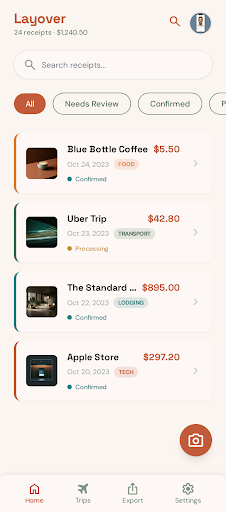
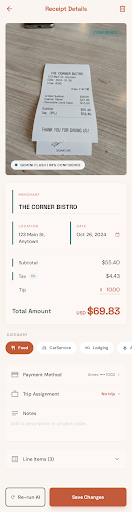
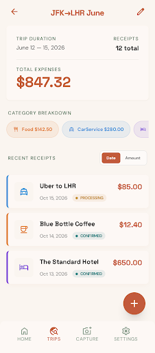
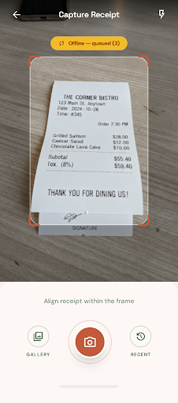

# Layover

**AI-powered receipt & travel-expense tracker — a self-hosted, offline-first mobile app with automatic OCR extraction.**

Snap a photo of any receipt and Layover reads it: merchant, date, tax, tip, total, currency, line items, and expense category are extracted automatically by a vision LLM, grouped into trips, and exported to ZIP / PDF / CSV for reimbursement. The whole stack runs on your own hardware — your receipts never touch a third-party SaaS.

<p align="left">
  
  
  
  
  
  
  
</p>

---

## Screenshots

| Home | Receipt Detail | Trip Detail |
|:---:|:---:|:---:|
|  |  |  |
| Filterable receipt feed with running total, review states, and quick-capture FAB. | AI-extracted fields with confidence, editable line items, and trip assignment. | Per-trip totals, category breakdown, and date-range summary. |

| Capture | Trips | Settings |
|:---:|:---:|:---:|
|  |  |  |
| Live viewfinder with alignment guides and an **offline queue** for no-signal capture. | Trips list with totals and receipt counts. | Server connection, AI model/threshold, naming templates, and defaults. |

---

## Highlights

- **Vision-LLM receipt extraction** — Images are sent to Google Gemini with a *constrained JSON schema* (structured output), so every extraction returns typed, validated data instead of free-form text that has to be parsed and repaired.
- **Cost-aware model escalation** — Every receipt is first read by the fast, cheap `gemini-2.5-flash`. If the model returns low confidence (`< 0.6`) or a zero total, the server automatically re-runs on the higher-accuracy `gemini-2.5-pro`. Fast and cheap by default; accurate when it matters.
- **Confidence-driven review workflow** — Receipts land in `PROCESSING → NEEDS_REVIEW / CONFIRMED / FAILED`. Low-confidence extractions are surfaced for a human check; the confidence threshold is user-configurable.
- **Offline-first capture** — Photos taken without connectivity are stored in a local SQLite queue and uploaded automatically when the device comes back online. No lost receipts on a plane or in a parking garage.
- **Trip organization & reporting** — Assign receipts to trips, then see per-trip totals and category breakdowns (Food, Lodging, Airfare, CarService, Parking, Tolls, Supplies, Other).
- **Bulk multi-format export** — Select any set of receipts and export to **ZIP** (original images, renamed), **PDF** (one receipt per page with metadata), or **CSV** (spreadsheet-ready) for expense reimbursement.
- **Configurable file-naming templates** — Exported filenames are generated from tokens like `{DATE}`, `{MERCHANT}`, `{CATEGORY}`, `{AMOUNT}`, `{CURRENCY}` — e.g. `2026-07-01_BlueBottleCoffee_Food_5.50.jpg`.
- **Multi-currency** — Currency is captured per receipt (3-letter ISO); a default currency is configurable.
- **Fully self-hosted** — Single `docker compose up`. SQLite database and image storage live on a mounted volume you control. No external database, no receipt data leaving your infrastructure (Gemini is the only outbound call, and only for OCR).

---

## Architecture

Layover is an npm-workspaces **monorepo** with three packages: an Expo mobile client, a Fastify API server, and a shared type/schema package that keeps the client and server contract in sync.

```
┌────────────────────┐        HTTPS (Bearer auth)        ┌────────────────────────┐
│   Mobile (Expo)    │  ───────────────────────────────▶ │   Nginx reverse proxy  │
│                    │                                    │   (buffers 50MB images)│
│  • Camera capture  │                                    └───────────┬────────────┘
│  • Offline queue   │                                                │ /api/*
│    (expo-sqlite)   │                                    ┌───────────▼────────────┐
│  • Status polling  │  ◀──── receipt JSON / images ────  │   Fastify API server   │
└────────────────────┘                                    │                        │
                                                           │  • REST routes         │
                        ┌───────────────────┐             │  • Prisma + SQLite     │
                        │  Google Gemini     │ ◀── image ──│  • sharp (thumbnails)  │
                        │  2.5 Flash / Pro   │ ─ JSON ───▶ │  • archiver / pdfkit   │
                        │  (structured OCR)  │             │  • image + file store  │
                        └───────────────────┘             └────────────────────────┘
```

**Receipt lifecycle**

1. Mobile uploads a base64 image → `POST /api/receipts`; the server stores the image + a `sharp`-generated thumbnail and creates a record with status `PROCESSING`.
2. Asynchronously, `gemini-2.5-flash` extracts structured fields; the server escalates to `gemini-2.5-pro` if confidence is low or the total is zero.
3. The record is updated with merchant, amounts, category, line items, and an auto-generated filename, then moved to `NEEDS_REVIEW` or `CONFIRMED`.
4. Mobile polls `GET /api/receipts/:id` (3s interval) until processing settles; the user can edit any field (`PATCH`) or re-run the AI on demand.
5. Export: `POST /api/export` builds ZIP/PDF/CSV, logs it, and returns a path the client downloads and hands to the native share sheet.

---

## Tech stack

| Layer | Technologies |
|---|---|
| **Mobile** | Expo SDK 56, React Native 0.85, React 19, TypeScript, React Navigation (native-stack + bottom-tabs), expo-camera, expo-sqlite (offline queue), expo-file-system, expo-sharing, expo-network, AsyncStorage |
| **Server** | Node 20, Fastify 5, Prisma 6 (SQLite), Zod, `@google/genai` (Gemini), `sharp` (image processing), `archiver` (ZIP), `pdfkit` (PDF), TypeScript, tsx |
| **Shared** | TypeScript interfaces + Zod schemas shared across client and server (`packages/shared`) |
| **Infra** | Docker multi-stage build, Docker Compose, Nginx reverse proxy, EAS Build (Android/iOS) |

---

## Project structure

```
Layover/
├── apps/
│   ├── mobile/                 # Expo React Native client
│   │   └── src/
│   │       ├── screens/        # Home, Capture, ReceiptDetail, Trips, TripDetail, Export, Settings
│   │       ├── navigation/     # Bottom tabs + stack
│   │       ├── api/            # HTTP client + auth/URL storage
│   │       ├── services/       # Offline queue + processor (expo-sqlite)
│   │       ├── components/     # ReceiptCard, badges, category chips
│   │       └── ui/             # Design tokens (theme.ts)
│   └── server/                 # Fastify REST API
│       ├── src/
│       │   ├── routes/         # receipts, trips, export, settings, health
│       │   ├── services/       # gemini, storage, export, filename
│       │   ├── middleware/     # Bearer-token auth
│       │   └── lib/            # Prisma client, error helpers
│       └── prisma/
│           ├── schema.prisma   # Receipt, Trip, LineItem, Setting, ExportLog
│           └── migrations/
├── packages/shared/            # Shared TS types + Zod schemas
├── Dockerfile                  # Multi-stage server build
├── docker-compose.yml          # server + nginx
└── nginx.conf                  # Reverse proxy (large uploads, AI timeouts)
```

---

## Getting started

### Prerequisites

- **Node.js 20+** and **npm** (workspaces)
- **Docker + Docker Compose** (for the server; recommended)
- A **Google Gemini API key** — create one at [Google AI Studio](https://aistudio.google.com/apikey)
- For the mobile app: the **Expo Go** app (quick start) or an **EAS**/dev build (for camera on a physical device)

### 1. Clone & install

```bash
git clone <your-fork-url> Layover
cd Layover
npm install          # installs all workspaces + builds packages/shared
```

### 2. Configure the server

Create `apps/server/.env`:

```env
PORT=8181
HOST=0.0.0.0
AUTH_TOKEN=choose-a-long-random-secret     # mobile app must send this as a Bearer token
GEMINI_API_KEY=your-gemini-api-key
DATABASE_URL=file:../data/recipts.db
UPLOAD_DIR=../data/uploads
DATA_DIR=../data
```

> The API is protected by a single shared **Bearer token** (`AUTH_TOKEN`). Use a long, random value — it's the only thing standing between your receipts and the internet. Never commit `.env` (it's gitignored).

### 3a. Run the server with Docker (recommended)

`docker-compose.yml` runs the API behind Nginx. It attaches to an external Docker network named `edge-network` so you can front it with your own reverse proxy or tunnel (Nginx Proxy Manager, Traefik, Cloudflare Tunnel, etc.):

```bash
# one-time: create the shared edge network (or edit docker-compose.yml to remove it)
docker network create edge-network

docker compose up -d --build
```

Migrations run automatically on container start (`docker-entrypoint.sh`). Data (SQLite DB, uploads, exports) persists in the `recipts_data` volume.

### 3b. Or run the server locally

```bash
npm run db:generate      # generate Prisma client
npm run db:migrate       # apply migrations
npm run dev:server       # tsx watch on PORT
```

### 4. Run the mobile app

```bash
npm run dev:mobile       # starts the Expo dev server
```

Open the app, go to **Settings → Server Connection**, and enter:

- **Server URL** — your API base, e.g. `https://receipts.yourdomain.com/api` or `http://<your-lan-ip>:8181/api`
- **Auth token** — the same `AUTH_TOKEN` you set on the server

Tap **Test Connection**, and you're live. (Camera capture requires a physical device with a dev/EAS build; the simulator can use the photo-library fallback.)

---

## Configuration reference

### Server environment variables

| Variable | Default | Description |
|---|---|---|
| `PORT` | `3001` | Port the Fastify server binds to (compose maps this to `8181`). |
| `HOST` | `0.0.0.0` | Bind address. |
| `AUTH_TOKEN` | `dev-token-change-me` | **Required in production.** Bearer token the client must present. |
| `GEMINI_API_KEY` | — | **Required.** Google Gemini API key for OCR extraction. |
| `DATABASE_URL` | `file:../data/recipts.db` | SQLite database location (Prisma). |
| `UPLOAD_DIR` | `../data/uploads` | Where receipt images + thumbnails are stored. |
| `DATA_DIR` | `../data` | Base data dir (exports live under `DATA_DIR/exports`). |

### In-app settings (per device, stored on device)

Server URL · Auth token · Default currency · AI model & confidence threshold · Auto-categorization toggles · Export filename template · Default trip.

---

## API reference

All routes are prefixed with `/api` and require `Authorization: Bearer <AUTH_TOKEN>` (except `/health`).

| Method | Endpoint | Description |
|---|---|---|
| `POST` | `/receipts` | Create a receipt from a base64 image (returns `PROCESSING`). |
| `GET` | `/receipts` | List with pagination + filters (`category`, `status`, `search`, `needsReview`, date range, sort). |
| `GET` | `/receipts/:id` | Full receipt with line items + trip. |
| `PATCH` | `/receipts/:id` | Update fields (marks `userEdited`). |
| `POST` | `/receipts/:id/reprocess?model=flash\|pro` | Re-run AI extraction. |
| `DELETE` | `/receipts/:id` | Delete receipt + images. |
| `GET` | `/receipts/:id/image` · `/thumbnail` | Serve full-res image / thumbnail. |
| `GET` / `POST` / `PATCH` / `DELETE` | `/trips[/:id]` | Trip CRUD with totals + category breakdowns. |
| `POST` | `/export` | Generate ZIP/PDF/CSV for a set of receipts. |
| `GET` | `/export/:path` · `/export/log` | Download an export / list recent exports. |
| `GET` / `PUT` | `/settings` | Read / upsert key-value settings. |
| `GET` | `/health` | Liveness probe (unauthenticated). |

---

## Data model (Prisma / SQLite)

- **Receipt** — image + thumbnail paths, merchant, location, dates, `currency`, `subtotal`/`tax`/`tip`/`total`, `category`, `paymentMethod`, `notes`, AI metadata (`aiRaw`, `aiConfidence`, `aiModel`), `status`, `userEdited`, generated `fileName`, optional `tripId`.
- **Trip** — `name`, `startDate`, `endDate`, `notes`, and its receipts.
- **LineItem** — `description` + `amount`, belonging to a receipt.
- **Setting** — key-value store for server-side defaults.
- **ExportLog** — audit trail of generated exports (`format`, `receiptIds`, `filePath`).

---

## Engineering notes

A few decisions worth calling out:

- **Typed, end-to-end contract.** `packages/shared` holds the Zod schemas and TypeScript types used by *both* the server (request/response validation) and the client, so a schema change surfaces as a compile error on both sides rather than a runtime surprise.
- **Structured LLM output over prompt-and-parse.** Gemini is called with a response JSON schema, turning an unreliable "read this receipt" prompt into a validated, typed extraction — no regex scraping of model prose.
- **Graceful degradation.** Offline queueing, GET retry-on-network-error, image-upload buffering tuned in Nginx (50 MB bodies, 120 s AI timeouts), and explicit `FAILED` states with retry make the unreliable parts (mobile networks, LLM rate limits) non-fatal.
- **Small, boring, self-hostable footprint.** SQLite + a file store + one container. No managed database, no queue broker — deliberately sized for a single-user, self-hosted deployment.

---

## Roadmap

- Multi-user accounts and role-based access
- Live FX conversion for multi-currency trip totals
- Receipt deduplication / duplicate detection
- Accounting-tool integrations (QuickBooks, Expensify export)

---

## License

This project is provided as a portfolio / reference project. Add a license file (e.g. MIT) before reuse.
